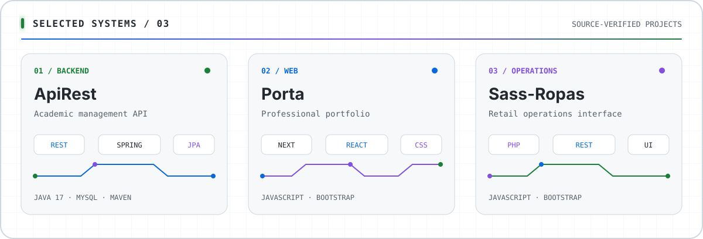

<picture>
  <source media="(prefers-color-scheme: dark)" srcset="./assets/hero-dark.svg">
  <source media="(prefers-color-scheme: light)" srcset="./assets/hero-light.svg">
  
</picture>

  <picture>
    <source media="(prefers-color-scheme: dark)" srcset="https://readme-typing-svg.demolab.com?font=JetBrains+Mono&amp;size=18&amp;duration=2600&amp;pause=900&amp;color=58A6FF&amp;center=true&amp;vCenter=true&amp;width=720&amp;height=45&amp;lines=Building+reliable+APIs;Shipping+modern+web+products;Learning+Docker+%26+application+security">
    
  </picture>

  Systems Engineering @ <strong>UNSM</strong> &nbsp;·&nbsp; Tarapoto, Peru &nbsp;·&nbsp; UTC−5

## Tech stack

  <picture>
    <source media="(prefers-color-scheme: dark)" srcset="https://skillicons.dev/icons?i=java%2Cspring%2Chibernate%2Cmaven%2Cmysql%2Cjs%2Creact%2Cnextjs%2Chtml%2Ccss%2Cgit%2Cgithub%2Clinux&amp;theme=dark&amp;perline=13">
    
  </picture>

<code>currently learning → Docker · microservices · application security</code>

## Selected systems

<picture>
  <source media="(prefers-color-scheme: dark)" srcset="./assets/showcase-dark.svg">
  <source media="(prefers-color-scheme: light)" srcset="./assets/showcase-light.svg">
  
</picture>

  <a href="https://github.com/ArturoVela/ApiRest"><strong>01 / ApiRest ↗</strong></a>
  &nbsp;&nbsp;·&nbsp;&nbsp;
  <a href="https://github.com/ArturoVela/Porta"><strong>02 / Porta ↗</strong></a>
  &nbsp;&nbsp;·&nbsp;&nbsp;
  <a href="https://github.com/ArturoVela/Sass-Ropas"><strong>03 / Sass-Ropas ↗</strong></a>

## GitHub signal

  <picture>
    <source media="(prefers-color-scheme: dark)" srcset="https://github-profile-summary-cards.vercel.app/api/cards/stats?username=ArturoVela&amp;theme=github_dark&amp;animation=rise">
    
  </picture>

  

Public repositories only · source-size snapshot generated with <a href="https://github.com/lowlighter/metrics">lowlighter/metrics</a>

  <strong>Open to backend and full-stack opportunities.</strong> 
  Build useful systems. Keep the interface clear. Make the evidence visible.

