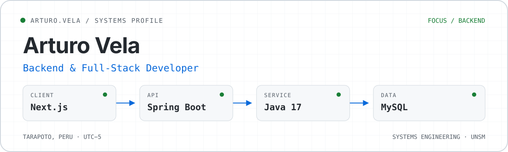
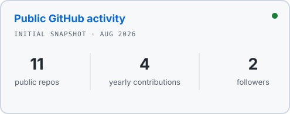

<picture>
  <source media="(prefers-color-scheme: dark)" srcset="./assets/hero-dark.svg">
  <source media="(prefers-color-scheme: light)" srcset="./assets/hero-light.svg">
  
</picture>

I build backend services and modern web applications with an emphasis on clear data models, maintainable APIs, and dependable user flows. I study Systems Engineering at the **Universidad Nacional de San Martín (UNSM)** in Peru.

My current work centers on **Java, Spring Boot, Next.js, and MySQL**. I am expanding that foundation through Docker, microservices, and secure application design.

## Selected work

### [API REST — Academic management](https://github.com/ArturoVela/ApiRest)

A REST API for managing clients and academic records, with complete CRUD flows and logical deletion for data that must remain auditable.

**What it demonstrates:** layered API development, persistence with Spring Data JPA, relational database integration, and documented endpoints.

`Java 17` · `Spring Boot 3` · `Spring Data JPA` · `Hibernate` · `MySQL` · `Maven`

---

### [Porta — Professional portfolio](https://github.com/ArturoVela/Porta)

A component-based portfolio created to present projects, skills, and services across desktop and mobile layouts.

**What it demonstrates:** reusable React components, responsive interface development, structured content, and foundational SEO work.

`Next.js` · `React` · `JavaScript` · `Bootstrap` · `CSS`

---

### [Sass-Ropas — Retail operations](https://github.com/ArturoVela/Sass-Ropas)

A PHP interface for multi-branch retail operations, covering cash movement, users, customer points, rewards, and audit views.

**What it demonstrates:** role-based operational screens, API integration, session-backed workflows, and responsive dashboards.

`PHP` · `REST APIs` · `Bootstrap` · `JavaScript` · `CSS`

## Technical toolbox

- **Backend:** Java 17, Spring Boot, Spring Data JPA, Hibernate, Maven, PHP
- **Web:** JavaScript, React, Next.js, HTML, CSS, Bootstrap
- **Data:** MySQL, relational modeling
- **Workflow:** Git, GitHub, Linux, IntelliJ IDEA, VS Code
- **Currently learning:** Docker, microservices, cybersecurity

## Public GitHub activity

  <picture>
    <source media="(prefers-color-scheme: dark)" srcset="./assets/github-stats-dark.svg">
    <source media="(prefers-color-scheme: light)" srcset="./assets/github-stats-light.svg">
    
  </picture>

The card is generated weekly from public GitHub activity and stored in this repository, so the last successful version remains available if an update fails.

---

I am interested in backend and full-stack opportunities where reliable systems, thoughtful interfaces, and continuous learning matter.
